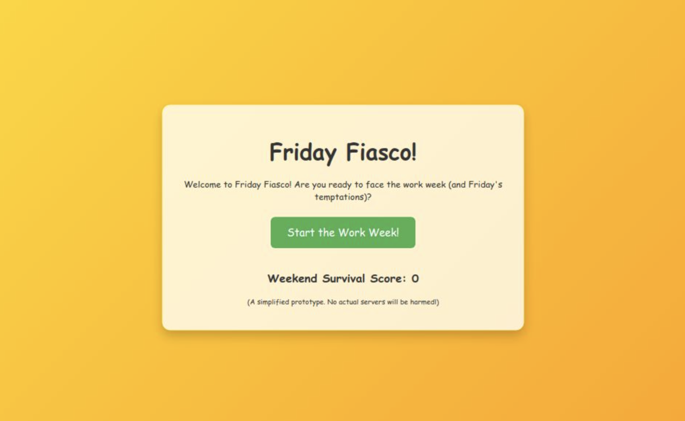

# 🎉 Friday Fiasco! 🎉

**👉 Play it Live: [friday-fiasco.raimonvibe.com](https://friday-fiasco.raimonvibe.com) 👈**

---

Ever felt that irresistible urge to deploy to production on a Friday afternoon? 😬 We've all been there! "Friday Fiasco" is a fun, interactive web game designed to humorously highlight why that might *not* always be the best idea. Meet "Friday," your charismatic weekend-loving guide, who will try to tempt you into one last push before the weekend. Will you resist, or will you dive headfirst into... the Fiasco? 🤪

## 😱 The Peril of Friday Deploys!

This game simulates the classic developer dilemma: the tempting shortcut of a Friday deployment versus the wisdom of waiting. Experience the potential chaos (like those dreaded 500 errors! サーバーダウン！) or the sweet, sweet relief of a stable production environment and a stress-free weekend.

## ✨ Features

* 😎 **Meet "Friday"**: Our star character! A super chill dude with sunglasses, slippers, and a cocktail, always ready to convince you "What could possibly go wrong?"
* ☀️ **Dynamic Visuals**: Enjoy a sunny, festive beach theme... until a bad push turns the scene into ⛈️ server chaos with red errors and crashing server icons!
* 🎮 **Interactive Gameplay**: Navigate a simplified work week and face the critical choice on Friday: to deploy or not to deploy?
* 😂 **Hilarious Animations & Dialogues**: If you choose to push, watch Friday gleefully "help" you into a fiasco! His lines are super relaxed and persuasive.
* 💡 **Educational Tips**: After a (simulated) deployment disaster, the app provides handy tips like "Always test in staging first" or "Plan deployments for Tuesday for less stress."
* 🏆 **Weekend Survival Score**: Keep track of how many times you've successfully resisted Friday's charm and earned a "Safe Weekend Badge."
* 😈 **Friday's Transformation**: Watch Friday turn from a laid-back buddy into a grinning prankster when things go south!

## 🕹️ How to Play

1.  **Start the Work Week**: Click the button to begin your week.
2.  **Advance Through Days**: The game will simulate progressing through Monday to Thursday.
3.  **Face Friday!**: On Friday, our character "Friday" will appear, trying to tempt you to deploy.
4.  **Make Your Choice**:
    * **Push to Production! 🚀**: Give in to Friday's charm and see what happens (spoiler: probably chaos!).
    * **No! Test & Wait! 🛡️**: Resist the urge, ensure stability, and enjoy a peaceful weekend.
5.  **See the Outcome**: Experience the visual and textual consequences of your choice.
6.  **Learn & Repeat**: Check out the educational tips if things go wrong, and try for a better Weekend Survival Score next week!

## 🎓 What You'll Learn (the Fun Way!)

* The importance of **not deploying on Fridays** (or at least being *very* careful).
* The value of **thorough testing** in a staging environment.
* The benefits of **planning deployments** during less critical times.
* The wisdom of having a **rollback plan**.

## 🚧 Disclaimer

This is a game! No actual servers are harmed, no real code is deployed, and no developers are (physically) pushed off virtual cliffs during the making or playing of "Friday Fiasco." It's all in good fun and for educational giggles. 😄

---

Enjoy the game and may all your weekends be fiasco-free! 🥳
